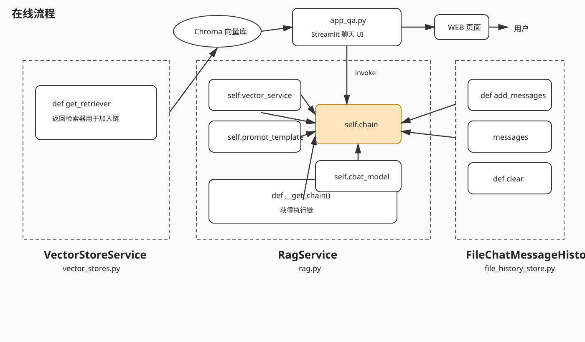

# 知识库项目开发逻辑

## 一、整体设计

这个项目的核心思路是把用户上传的文档转换成可以检索的知识片段，并使用向量数据库保存这些片段。当前代码的处理链路可以概括为：

```text
用户上传文件
    -> 根据文件类型提取文本
    -> 使用文本内容计算 MD5
    -> 判断是否重复
    -> 按配置切分文本
    -> 使用 Embedding 模型将文本转换为向量
    -> 保存到 Chroma 向量数据库
```

`app_file_uploader.py` 负责网页交互和文件内容提取，`knowbase.py` 负责去重、文本切分、向量化和向量数据库写入，`config_data.py` 集中保存这些模块共同使用的配置。  【黑马程序员大模型RAG与Agent智能体项目实战教程，基于主流的LangChain技术从大模型提示词到实战项目】 https://www.bilibili.com/video/BV1yjz5BLEoY/?p=50&share_source=copy_web&vd_source=0768325c444725a2e5eb573f95e6e3b5


## 二、上传文件的代码逻辑

### 1. 创建网页上传入口

`app_file_uploader.py` 使用 Streamlit 创建网页端服务：

```python
st.title("知识库更新服务")
```

Streamlit 程序不是使用普通的 Python 方式启动，而是在终端执行：

```powershell
python -m streamlit run app_file_uploader.py
```

### 2. 批量上传的处理方式

文件上传器配置为：

```python
files = st.file_uploader(
    "上传文件",
    type=["txt", "pdf", "docx"],
    accept_multiple_files=True,
)
```

`accept_multiple_files=True` 表示允许一次选择多个文件。因此 `files` 是文件对象列表，而不是单个文件对象。代码先判断列表是否为空，再逐个处理：

```python
if files:
    for uploaded_file in files:
```

### 3. 读取文件基本信息

每个上传文件都可以读取文件名、类型和大小：

- `uploaded_file.name`：文件名。
- `uploaded_file.type`：浏览器提供的文件类型。
- `uploaded_file.size`：文件大小，单位是字节。

代码将文件大小除以 `1024` 转换成 KB：

```python
file_size = uploaded_file.size / 1024
```

### 4. 按文件类型提取文本

不同格式的文件在底层的存储方式不同，不能把所有文件都当成 UTF-8 文本处理。代码根据文件扩展名选择解析器，最后统一得到字符串变量 `content`。

#### TXT

TXT 文件的内容是文本字节，可以使用 UTF-8 解码：

```python
content = uploaded_file.getvalue().decode("utf-8")
```

#### PDF

PDF 不是普通文本文件，不能直接调用 `decode("utf-8")`。程序使用 `pypdf` 读取每一页，再把页面文本拼接起来：

```python
reader = PdfReader(uploaded_file)
content = "\n".join(
    page.extract_text() or ""
    for page in reader.pages
)
```

`page.extract_text()` 可能返回 `None`，所以使用 `or ""`，避免拼接字符串时出现错误。

#### DOCX

DOCX 是一种文档格式，也不能直接 UTF-8 解码。程序使用 `python-docx` 读取文档中的段落：

```python
document = Document(io.BytesIO(uploaded_file.getvalue()))
content = "\n".join(
    paragraph.text
    for paragraph in document.paragraphs
)
```

`uploaded_file.getvalue()` 得到的是文件字节，`io.BytesIO` 把这些字节包装成可以被 `Document` 读取的内存文件对象。

## 三、MD5 内容去重算法

### 1. 为什么使用文件内容 MD5

MD5 是一种哈希算法。它把任意长度的数据映射成固定长度的十六进制字符串。在当前设计中，MD5 的输入是文件提取出的文本内容，而不是文件名。

因此：

- 文件名不同但内容相同，计算出的 MD5 相同，可以识别为重复内容。
- 文件内容发生变化，计算出的 MD5 通常也会变化，可以作为新的内容处理。
- 比较固定长度的 MD5 字符串，比直接比较整篇文档更方便。

### 2. `get_md5` 的执行过程

```python
byte_array = input.encode(encoding)
md5_obj = hashlib.md5()
md5_obj.update(byte_array)
md5_hexdigest = md5_obj.hexdigest()
```

处理顺序是：字符串先使用 UTF-8 转换为字节数组；然后创建 MD5 对象并更新数据；最后使用 `hexdigest()` 得到便于保存和比较的十六进制字符串。

### 3. `check_md5` 的查询过程

MD5 值被逐行保存到 `config.md5_path` 指定的文本文件中。检查时：

1. 如果文件不存在，先创建空文件，并返回 `False`。
2. 读取文件中的每一行。
3. 使用 `strip()` 去掉行尾换行符和两端空白。
4. 将处理后的内容与传入的 MD5 值比较。
5. 找到相同值返回 `True`，遍历结束仍未找到则返回 `False`。

### 4. `upload_file` 中的去重位置

`upload_file` 先计算 MD5，再检查是否存在：

```python
md5_hex = get_md5(data)

if check_md5(md5_hex):
    print(f"文件 {file_name} 已经存在，跳过存储。")
    return False
```

去重检查放在文本切分和向量化之前，目的是让重复文件尽早结束流程，避免重复调用切分器、Embedding 模型和向量数据库。

## 四、配置驱动的处理方式

`config_data.py` 把处理流程中的参数集中管理：

```python
md5_path = "./md5.txt"
knowbase_name = "RAG_demo"
persist_directory = "./chroma_db"
embedding_model = "DashScope/CodeBERTa-small-v1"
chunk_size = 1000
chunk_overlap = 100
separators = ["\n\n", "\n", " ", ""]
```

这样做的思想是把“代码逻辑”和“可调参数”分开。修改切分长度、数据库目录或模型名称时，主要修改配置文件，不需要进入业务流程中寻找散落的常量。

## 五、文本切分算法

`KnowledgeBaseService` 使用 `RecursiveCharacterTextSplitter` 处理较长文本：

```python
self.spliter = RecursiveCharacterTextSplitter(
    chunk_size=config.chunk_size,
    chunk_overlap=config.chunk_overlap,
    separators=config.separators,
    length_function=len,
)
```

### 1. 为什么要切分

文档可能很长，而向量检索通常不是把整篇文档作为一个整体进行匹配，而是把文档拆成多个较小片段。用户查询时，系统可以找到与问题最相关的片段，而不是返回整篇文档。

### 2. 递归分隔的思想

`separators` 按优先级排列：

```python
["\n\n", "\n", " ", ""]
```

切分器会优先尝试在段落之间切分，无法满足长度要求时再尝试换行、空格，最后才使用更细的字符级切分。这样可以尽量保留原文的语义结构。

`chunk_size=1000` 表示片段长度目标，`chunk_overlap=100` 表示相邻片段之间保留一部分重复内容。重叠区域可以减少语义被切断时的信息损失。

### 3. 当前条件判断

```python
if len(data) > config.chunk_size:
    chunks: list[str] = self.spliter.split_text(data)
else:
    chunks: list[str] = [data]
```

如果文本没有超过切分阈值，就保留为一个片段；只有较长文本才调用切分器。这样可以避免对短文本进行没有必要的切分。

## 六、向量化和 Chroma 存储

### 1. 初始化向量数据库

初始化服务时先创建持久化目录：

```python
os.makedirs(config.persist_directory, exist_ok=True)
```

`exist_ok=True` 表示目录已经存在时不报错。

随后创建 Chroma 对象：

```python
self.chroma = Chroma(
    collection_name=config.knowbase_name,
    embeddings=DashScopeEmbeddings(model=config.embedding_model),
    persist_directory=config.persist_directory,
)
```

这里把三个对象组合起来：

- `collection_name`：指定知识集合的名称。
- `embeddings`：指定如何把文本转换成向量。
- `persist_directory`：指定向量数据保存到本地的位置。

### 2. 保存文本片段

切分完成后，代码调用：

```python
self.chroma.add_texts(
    chunks,
    metadatas=[metadatas for _ in chunks],
)
```

`chunks` 中的每个文本片段会被 Embedding 模型转换成向量，再交给 Chroma 保存。每个片段同时绑定一份元数据，用于以后知道片段来自哪个文件以及上传时间。

### 3. 元数据的作用

```python
metadatas = {
    "source": file_name,
    "upload_time": datetime.now().strftime("%Y-%m-%d %H:%M:%S")
}
```

元数据不直接参与正文文本的切分，但会随向量一起保存。检索到片段后，可以通过 `source` 找到来源文件，通过 `upload_time` 了解写入时间。

## 七、`upload_file` 的完整执行顺序

`KnowledgeBaseService.upload_file(data, file_name)` 的算法顺序是：

1. 先计算和检查 MD5，避免重复内容进入后续流程。
2. 根据文本长度决定是否切分。
3. 创建统一的来源和时间元数据。
4. 调用 Chroma 保存文本片段，期间由 Embedding 模型完成向量化。
5. 向量写入成功后再保存 MD5，避免数据库写入失败却提前记录为已存在。
6. 返回处理结果，让调用方知道是跳过还是成功写入。

这体现了一个重要的流程设计：先做成本较低的判断，再做成本较高的向量化操作；只有数据库写入成功后，才记录去重凭证。


## 八、前端与后端的连接，以及 Streamlit 的状态问题

### 1. 当前系统中的前端和后端

在这个项目中，前端主要指 `app_file_uploader.py` 中的 Streamlit 页面。它负责让用户选择文件，并把文件内容提取成字符串后显示出来。

后端主要指 `knowbase.py` 中的 `KnowledgeBaseService`。它负责接收文本数据和文件名，然后执行 MD5 去重、文本切分、向量化和 Chroma 数据库存储。

完整的业务链路应该是：

```text
浏览器上传文件
    -> Streamlit 得到 UploadedFile
    -> 前端提取出文本 content
    -> 调用 KnowledgeBaseService.upload_file(content, file_name)
    -> 后端进行 MD5 检查、切片、向量化和入库
    -> 前端显示处理结果
```

### 2. 如果前后端不连接，会有什么问题

如果前端只负责显示文本，后端只在 `knowbase.py` 中单独存在，那么用户在网页上上传文件时，文件内容只会停留在前端脚本的 `content` 变量里：

```python
st.write(content)
```

这只能把内容显示在页面上，并不会自动执行：

```python
service.upload_file(content, file_name)
```

因此会产生几个直接问题：

1. 用户看到文件内容，不代表内容已经进入知识库。
2. MD5 不会被检查或保存，重复文件无法在上传流程中被拦截。
3. 文本不会进入 `RecursiveCharacterTextSplitter`，也不会被切成适合检索的片段。
4. Embedding 模型不会被调用，文本不会转换成向量。
5. Chroma 不会收到数据，后续检索时自然找不到刚才上传的内容。

页面上“上传成功”与知识库中“已经可以检索”是两个不同的概念。只有前端把提取出的文本明确传给后端的 `upload_file`，这两条链路才真正连起来。

### 3. 为什么当前还不能算前后端已经连接

当前 `app_file_uploader.py` 中，文件处理完成后执行的是：

```python
st.write(content)
```

这里没有导入 `KnowledgeBaseService`，也没有创建服务对象，更没有调用 `upload_file`。因此当前代码链路在“提取文本并显示”这里结束了。

`knowbase.py` 虽然已经具备 `upload_file` 的处理逻辑，但它不会因为文件在网页上被上传就自动执行。Python 模块中的类和函数必须被其他代码导入、创建和调用，才能真正参与运行流程。

判断前后端是否连接，不能只看两个文件是否都存在，而要看调用关系是否存在：

```text
app_file_uploader.py
    -> 导入 KnowledgeBaseService
    -> 创建 KnowledgeBaseService 对象
    -> 调用 upload_file
```

### 4. Streamlit 的重新执行机制

Streamlit 和传统的前后端框架有一个重要区别：当用户操作页面导致页面更新时，Streamlit 通常会从上到下重新执行一次脚本。

例如，用户上传文件时，程序会执行一遍：

```python
files = st.file_uploader(...)

if files:
    for uploaded_file in files:
        content = ...
        st.write(content)
```

当用户再次上传文件、改变组件内容，或者刷新页面时，脚本会再次从第一行开始执行。普通变量不会像传统后端中的长期对象一样自动保留，因为每次执行都可能产生新的运行上下文。

### 5. 状态丢失的具体例子

假设我们使用普通变量记录上传文件：

```python
uploaded_file_names = []

if files:
    for uploaded_file in files:
        uploaded_file_names.append(uploaded_file.name)

st.write(uploaded_file_names)
```

第一次上传 `a.txt` 时，页面可能显示：

```text
["a.txt"]
```

如果之后用户又上传 `b.txt`，程序重新执行时，`uploaded_file_names = []` 也会重新执行。之前的列表不会自动延续，程序看到的可能只是一轮执行中重新产生的数据，而不是一个可靠的历史状态。

对于知识库应用，这个问题的影响会更明显：用户上传文件后，如果再次上传、刷新页面或操作其他组件，脚本重新执行，页面中的上传记录、处理结果和临时对象可能被重新创建。这样可能导致重复处理、页面提示与实际入库结果不一致，甚至让用户误以为文件已经保存或没有保存。

需要注意的是，已经写入 `md5.txt` 和 Chroma 持久化目录的数据属于外部持久化数据，不会因为脚本变量重新创建就自动消失；但页面中的普通变量、临时处理结果和对象引用不能依赖这种持久化机制。

### 6. `st.session_state` 的作用

Streamlit 提供 `st.session_state` 保存同一个用户会话中的状态。它类似一个与当前浏览器会话绑定的字典，可以在脚本多次重新执行时保留指定的数据：

```python
if "uploaded_file_names" not in st.session_state:
    st.session_state.uploaded_file_names = []

if files:
    for uploaded_file in files:
        st.session_state.uploaded_file_names.append(uploaded_file.name)

st.write(st.session_state.uploaded_file_names)
```

每次脚本重新执行时，都会先检查状态是否已经存在。只有第一次执行时才创建空列表，后续执行会继续使用原来的列表。

在这个知识库项目中，`session_state` 可以用于保存页面层面的会话状态，例如当前会话已经选择过的文件信息、每个文件的处理结果、当前页面显示的历史上传记录，以及当前会话是否已经初始化某些服务对象。

`session_state` 解决的是页面重新执行后，前端会话变量如何保留的问题。它不能代替 Chroma，也不能代替 `md5.txt`：

- `session_state` 主要保存当前会话中的页面状态。
- `md5.txt` 负责保存内容去重记录。
- Chroma 负责持久化保存文本片段、向量和元数据。

这三者的职责不同，不能因为使用了 `session_state` 就认为数据已经保存进知识库。

### 7. 当前代码如何连接前端和后端

现在前端已经导入知识库服务：

```python
from knowbase import KnowledgeBaseService
```

然后使用 `st.session_state` 创建并保存服务对象：

```python
if "service" not in st.session_state:
    st.session_state.service = KnowledgeBaseService()
```

第一次执行时，程序创建 `KnowledgeBaseService`，完成 Chroma 和文本切分器的初始化；后续页面重新执行时，因为 `service` 已经存在，所以会继续使用原来的对象，不会重复创建。

文件完成文本提取后，前端调用后端方法：

```python
result = st.session_state.service.upload_file(content, file_name)
st.write(result)
```

这一步使处理链路从“页面显示文本”继续进入“MD5 检查、文本切分、向量化和数据库存储”。后端返回的结果再由前端显示给用户，形成了从上传到入库的调用闭环。

## 九、运行方式和依赖

主要依赖安装命令：

```powershell
python -m pip install streamlit python-docx pypdf
python -m pip install langchain langchain-chroma langchain-community
python -m pip install langchain-text-splitters dashscope
```

启动网页端：

```powershell
python -m streamlit run app_file_uploader.py
```

学习这套代码时，可以始终按照下面的主线理解：文件先变成文本，文本再变成片段，片段再变成向量，向量和元数据最后一起进入向量数据库；MD5 则负责在进入昂贵的切分和向量化步骤之前，阻止相同内容重复处理。  

## 十、在线流程开发

在线问答流程是在前面“文档上传和入库”基础上的下一步：用户通过网页提出问题，系统从已经保存的向量数据中找到相关内容，再交给 RAG 链组织答案。按照当前的设计图，这部分主要由三个服务共同完成。

### 1. 向量检索服务

`VectorStoreService` 负责加载已经持久化的 Chroma 向量库，并提供一个可以加入执行链的检索器：

```python
def get_retriever(self):
    # 返回检索器，用于加入 RAG 链
    ...
```

它的核心作用不是重新上传或切分文件，而是把用户的问题转换成查询条件，在 Chroma 中找到语义相关的文本片段。`get_retriever` 返回的对象会作为 RAG 链中的检索环节，为后续回答提供上下文。

### 2. 文件历史消息存储服务

`FileChatMessageHistory` 负责保存用户和系统之间的历史聊天记录，主要围绕三个逻辑：

- `add_messages`：追加新的对话消息。
- `messages`：读取已经保存的历史消息。
- `clear`：清空当前会话的历史记录。

历史消息和 Chroma 中的知识片段用途不同：Chroma 保存的是可检索的文档知识，历史消息保存的是当前用户与系统的对话上下文。两者结合后，系统既能参考文档内容，也能理解当前对话的连续语境。

### 3. RAG 服务的成员变量

`RagService` 是在线问答流程的核心服务，图中包含几个关键成员：

- `self.vector_service`：向量检索服务，用于获取相关文档片段。
- `self.prompt_template`：提示词模板，用于规定如何把问题、历史消息和检索内容组织给模型。
- `self.chat_model`：聊天模型，负责根据提示词和上下文生成回答。
- `self.chain`：最终执行链，把检索器、提示词模板和聊天模型连接起来。

`__get_chain()` 的职责是组装并返回这条执行链。在线请求到来后，RAG 服务会把用户问题交给链处理，链内部大致按照下面的方向执行：

```text
用户问题
    -> 向量检索器获取相关文档片段
    -> 组合历史消息、问题和检索结果
    -> 套用 prompt_template
    -> 交给 chat_model 生成回答
    -> 返回给 Streamlit 聊天页面
```

### 4. 在线调用关系

`app_chat.py` 负责 Streamlit 聊天页面。用户在网页中输入问题后，页面调用 `RagService` 的执行链；RAG 服务通过 `VectorStoreService` 访问 Chroma，通过 `FileChatMessageHistory` 读取和保存会话记录，最后把模型回答返回给网页。

整体关系可以理解为：

```text
 app_chat.py
    -> RagService.chain
        -> VectorStoreService.get_retriever()
            -> Chroma 向量库
        -> prompt_template
        -> chat_model
        -> FileChatMessageHistory
```

流程图如下：



这部分的关键思想是职责分离：检索器负责“找资料”，历史消息服务负责“记住对话”，RAG 服务负责“组织上下文并调用模型”，Streamlit 页面负责“接收输入和展示输出”。

## 十一、当前项目完整开发日志

### 1. 文档入库链路

文件上传页面位于 `app_file_uploader.py`。用户可以批量上传 TXT、PDF 和 DOCX 文件，程序先根据文件类型提取出统一的字符串内容，再把文本和文件名传给 `KnowledgeBaseService.upload_file`。

`KnowledgeBaseService` 的处理顺序是：

```text
文本内容
    -> get_md5 计算内容指纹
    -> check_md5 判断是否重复
    -> RecursiveCharacterTextSplitter 切分长文本
    -> DashScopeEmbeddings 生成向量
    -> Chroma.add_texts 保存文本、向量和元数据
    -> save_md5 保存已入库内容的指纹
```

MD5 检查放在切分和向量化之前，避免相同内容重复消耗模型调用和数据库写入；只有 Chroma 写入成功后才保存 MD5，避免入库失败却被错误标记为已经处理。

### 2. 在线问答链路

聊天页面位于 `app_chat.py`，核心服务位于 `rag.py`。当前在线问答的调用关系是：

```text
用户输入问题
    -> app_chat.py 调用 RagService.chain
    -> itemgetter("input") 提取问题文本
    -> VectorStoreService 检索 Chroma 中的相关片段
    -> format_documents 整理正文和元数据
    -> ChatPromptTemplate 组合系统提示词、历史消息、问题和参考资料
    -> ChatTongyi 生成回答
    -> StrOutputParser 转成字符串
    -> Streamlit write_stream 流式显示
```

这里使用 `itemgetter("input")` 是因为链的输入是一个字典，例如 `{"input": prompt}`，而向量检索器需要接收问题字符串。若把整个字典直接传给检索器，检索输入类型就不正确。

### 3. 历史消息链路

`file_history_store.py` 使用 JSON 文件保存 `BaseMessage` 对象：

- `add_messages` 把新消息转换为字典后写入文件。
- `messages` 读取 JSON 并恢复成 LangChain 消息对象。
- `clear` 用空列表覆盖当前会话文件。

`rag.py` 使用 `RunnableWithMessageHistory` 将历史服务包在 RAG 链外层，并通过 `session_id` 区分会话。每次调用时，链会读取历史消息；调用完成后，用户问题和模型回答会自动写回对应文件。

`app_chat.py` 使用 `uuid4()` 为当前浏览器会话生成独立的 `session_id`，避免不同会话共同使用同一个历史文件。Streamlit 的 `st.session_state` 负责保存当前页面中的 RAG 对象、消息显示列表和会话 ID；JSON 文件则负责跨页面重新执行保存聊天记录。


### 5. 当前项目的完整理解方式

可以把整个项目分成两个相互衔接的阶段：

```text
离线知识库更新阶段：
上传文件 -> 提取文本 -> MD5 去重 -> 文本切分 -> 向量化 -> Chroma 入库

在线问答阶段：
用户提问 -> 向量检索 -> 组合历史和参考资料 -> 提示词 -> 聊天模型 -> 流式回答
```

前一个阶段决定“知识库里有什么”，后一个阶段决定“如何根据知识库回答问题”。`md5.txt`、Chroma、聊天历史 JSON 和 `st.session_state` 分别承担内容去重、知识持久化、对话持久化和页面会话状态四种不同职责。

运行在线聊天页面时使用：

```powershell
python -m streamlit run Langchain_RAG_HeiMa/app_chat.py
```

运行上传页面时使用：

```powershell
python -m streamlit run Langchain_RAG_HeiMa/app_file_uploader.py
```

在线调用还需要正确配置 DashScope 的访问凭证，并确保配置中的 Embedding 模型和聊天模型是当前账号可用的模型。Python 编译检查只能验证语法和模块结构，不能替代真实模型调用、网络访问和向量库写入测试。

